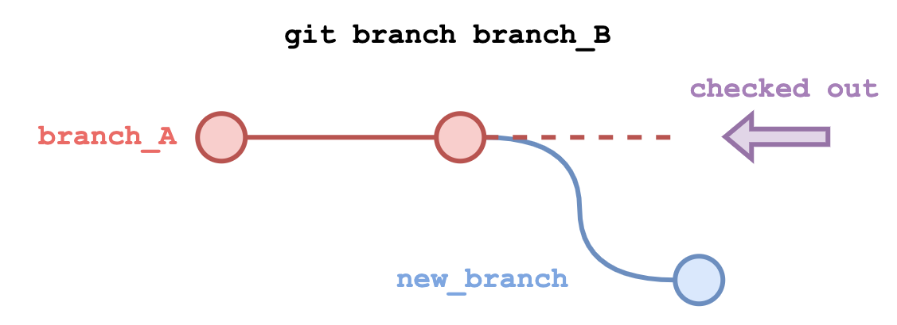
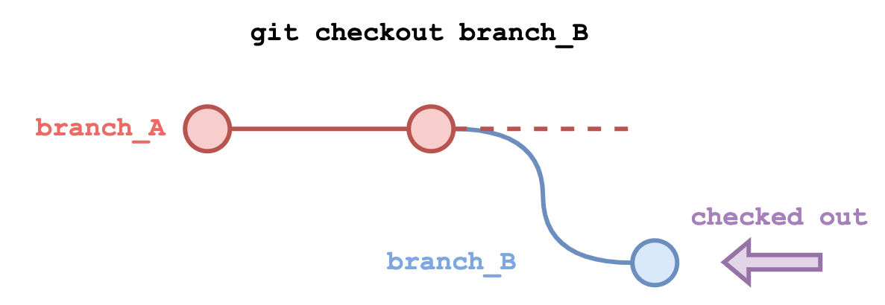
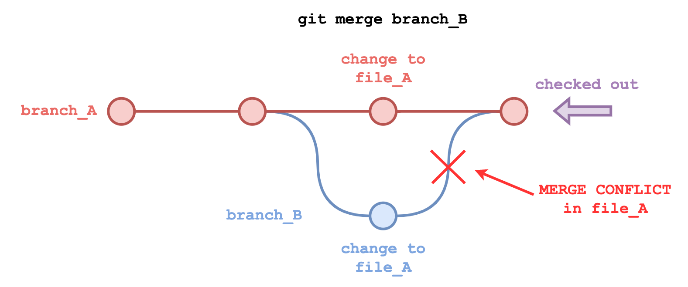
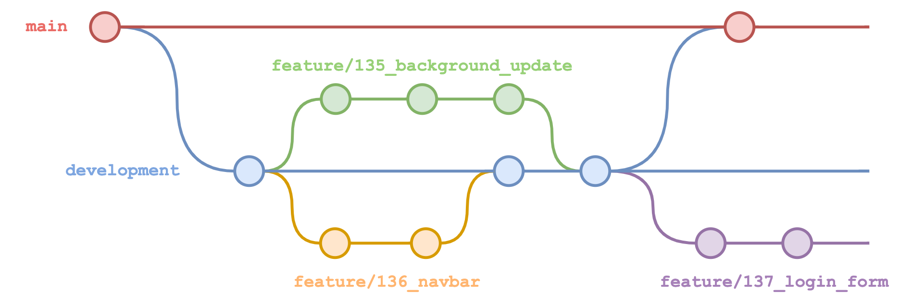

# Branching

- [Branching](#branching)
  - [Overview](#overview)
  - [Branching](#branching-1)
    - [Creating a Branch](#creating-a-branch)
    - [Switching to a Branch](#switching-to-a-branch)
    - [Merging Branches](#merging-branches)
      - [Resolving Merge Conflicts](#resolving-merge-conflicts)
    - [Deleting a Branch](#deleting-a-branch)
  - [Feature Branch Model](#feature-branch-model)
    - [`main` or `master`](#main-or-master)
    - [`development` or `dev`](#development-or-dev)
    - [`feature/*`](#feature)
    - [Other Branches](#other-branches)
  - [Tutorial](#tutorial)
    - [Create a New Repository](#create-a-new-repository)
    - [Make a New Branch](#make-a-new-branch)
    - [Merge a New Commit from `dev` to `master`](#merge-a-new-commit-from-dev-to-master)
    - [Cause a Merge Conflict](#cause-a-merge-conflict)
    - [Resolve the Merge Conflict](#resolve-the-merge-conflict)
  - [Exercises](#exercises)

## Overview

Git has the ability to track multiple, independent, concurrent version histories for a project using **branches**.

These are essentially different historical timelines for the project. By keeping track of these diverging, concurrent project timelines, Git allows developers to switch between them instantly.

## Branching

As a version control system, Git's primary function is to record the history of every change that has been made to a project since it started.

Git is able to keep track of multiple, diverging versions of the same project that do not share the exact same version history. These diverging histories are known as **branches**.

You can view all local branches with the command:

```bash
git branch
```

A list of branches will appear for the repository, with the branch currently checked out being highlighted in green with an asterisk.

The branch that is *checked out* is the branch whose files you can see and that any commits will be made to.

You can view all branches – including remote branches – with the command:

```bash
git branch --all
```

### Creating a Branch

To create a branch:

```bash
git branch <branch_name>
```



This will create a branch that contains the full commit history of the branch that is currently checked out.

The branch will be created, but you will still be working on the branch you were on before.

### Switching to a Branch



Developers can switch to a different branch within a Git project instantly.

To switch to (or 'checkout') another branch:

```bash
git checkout <branch_name>
```

All commits from this point will be made to the newly-checked-out branch. Switching back to the first branch will bring the project back to the last commit on that branch.

To create and then checkout a branch in one command:

```bash
git checkout -b <branch_name>
```

### Merging Branches


To combine the commits made to one branch with another, we can merge them with:

```bash
git merge <branch_name>
```

If we're looking to merge `branch_A` into `branch_B`, we should checkout `branch_A` and provide `branch_B` as the argument for the command.

#### Resolving Merge Conflicts



Git will attempt to resolve as many differences between two branches as it can when they are merged.

For example, if `file_A` was changed in `branch_A` and `file_B` was changed in `branch_B`, there should be no conflict that takes place when the merge occurs.

However, if `file_A` was changed in both branches A and B, it is possible that a merge conflict will arise.

After running `git merge branch_B` while checking out `branch_A`, you would see the message:

```text
Auto-merging file_A
CONFLICT (content): Merge conflict in file_A
Automatic merge failed; fix conflicts and then commit the result.
```

At this point, the developer has to resolve the conflict. They can do so by opening the conflicting file (in this case, `file_A`) in a text editor.

The conflicting line(s) will be highlighted like so:

```text
<<<<<< HEAD
This line was written on branch A!
=======
This line was written on branch B!
>>>>>> branch_B
```

Where `<<<<<<< HEAD` refers to the line based on the currently checked-out branch's most recent commit, and `>>>>>>> branch_B` refers to the change that is incoming from the branch being merged (`branch_B`).

The developer then needs to decide which line or lines they are going to keep. They may decide to resolve it by:

- Keeping the current line on `branch_A`:
  ```text
  This line was written on branch A!
  ```
- Overwrite the line on `branch_A` with the line on `branch_B`:
  ```text
  This line was written on branch B!
  ``` 
- Keep both lines:
  ```text
  This line was written on branch A!
  This line was written on branch B!
  ```
- Replace it with something else entirely:
  ```text
  This is a totally new line!
  ```

How the developer resolves the change is down to their discretion. Git will consider the conflict resolved when the `<<<<<< HEAD`, `=======` and `>>>>>> branch_B` lines are deleted.

Once the changes have been saved to the file, the developer must then stage and commit their changes:

```bash
git add `file_A`
git commit -m "resolving merge conflict"
```

Finally, branch B will be merged into `branch_A`.

Merge conflicts commonly occur when developers are attempting to push and merge their new features to the main repository to *integrate* them.

While a developer has been working on their feature branch, their colleague may have pushed and merged their work. Then the developer then attempts to merge their work to the central repo, they will need to incorporate their colleagues changes first.

### Deleting a Branch

To delete a branch:

```bash
git branch -d <branch_name>
```

The `-d` option will only delete the branch if the commits made on said branch have been merged into another branch. This is to prevent you from accidentally deleting your work.

To force a branch to be deleted without being merged, you can use `-D` instead:

```bash
git branch -D <branch_name>
```

## Feature Branch Model

Branching is an invaluable tool for development teams as it allows for developers to work on multiple features concurrently without fear of breaking each other's work. Each branch serves as an isolated development environment.

However, without a plan or model for organising these branches, branching can become overcomplicated, unwieldy and confusing, with developers making either too many or too few branches to do their development.

A model for organising how branches are used in a development pipeline keeps the project simple and trackable.



The **feature branch model** is a common model for organising a team's branches. It is designed to integrate with Agile methodogies such as Scrum, DevOps and continuous integration (CI).

Using this model, new software releases are controlled by the branch structure. Features are developed on **feature branches**, which are merged into **development** when completed. When the features are ready to be released, **development** is then merged into **main**.

Exact terminology and naming conventions within feature branch models changes per development team and organisation, but the general structure of the model contains the following branches:

### `main` or `master`

This branch contains code that is *released* or *ready for release*.

Code on this branch should be fully tested, peer reviewed and approved. Under no circumstances should unfinished or unreviewed work be pushed to the `main`/`master` branch!

### `development` or `dev`

This branch should only contain features that are *ready for release*, but have **not** been released.

Individual features merged into `dev` should be fully tested, peer reviewed and approved, but the overall software is not considered release-ready.

It effectively serves as the staging environment for new features. When a release 

### `feature/*`

Branches with the prefix `feature/` serve as the versions of the code that are still under development.

When developers are working on a new feature, they will create a new feature branch off the `development` branch and once it is completed, it will be merged back into `development`.

Merging a feature branch to `development` would typically take place using the **Pull Request (PR)** feature provided by the repository-hosting service (such as GitHub or GitLab) rather than on the command line. PRs allow proposed merges to be reviewed and approved *before* the merge takes place.

The feature branch should then be deleted.

### Other Branches

A team's branch model may also contain branch types for:

- **Hotfixes** – quick updates made directly to the `main`/`master` branch, usually to fix a critical bug that made it into production and needs immediate fixing. Hotfixes should generally be avoided unless absolutely necessary, as they effectively circumvent the production pipeline entirely.

- **Bugfixes** – updates that are made to fix bugs, but are not made directly to `main`/`master` as they are not critical issues.

- **Release Candidate** – new releases may not be merged directly from `dev` to `main`, but instead an intermediate branch will be created as a 'release candidate'. This allows developers to continue working on new features and merging to `dev` without merging them into an upcoming release.

## Tutorial

This tutorial will take you through how to:

- Create a new branch.
- Make changes to the project on the new branch and merge them into the original branch.
- Cause and then resolve a merge conflict.

### Create a New Repository

1. Open your terminal program (*Git Bash* on Windows, *Terminal* on macOS or Ubuntu).

2. Change directory to your Documents folder:

    ```bash
    cd ~/Documents
    ```

3. Make a new folder called `git-branching-tutorial`:

    ```bash
    mkdir git-branching-tutorial
    ```

4. Make the folder the current working directory:

    ```bash
    cd git-branching-tutorial
    ```

5. Initialise the folder as a Git repository:

    ```bash
    git init
    ```

6. List the branches created by this repository:

    ```bash
    git branch
    ```

    You'll see an empty list. This is because Git won't create a branch until the first commit has been made.

7. Create a new file:

    ```bash
    touch file_A
    ```

8. Stage and commit the new file:

    ```bash
    git add README.md
    git commit -m "init commit - added file_A"
    ```

### Make a New Branch

1. List the branches created by this repository:

    ```bash
    git branch
    ```

    You should see one branch listed called `master`:

    ```text
    * master
    (END)
    ```

    The asterisk and green text indicate that this is the currently checked-out branch. Any commits made now will be recorded as part of this branch's version history.

2. Make a new branch called `dev` with the command:

    ```bash
    git branch dev
    ```

    Use `git branch` to check the branch as been created. `master` should still be checked out.

3. Checkout the `dev` branch:

    ```bash
    git checkout dev
    ```

    Use `git branch` to check that the `dev` branch is now checked out.

### Merge a New Commit from `dev` to `master`

1. Create a new file called `file_B`:

    ```bash
    touch file_B
    ```

    List the contents of the repository with `ls`. You should see both `file_A` and `file_B`.

2. Stage and commit `file_B`:

    ```bash
    git add file_B
    git commit -m "created file_B"
    ```

3. Checkout to the `master` branch:

    ```bash
    git checkout master
    ```
    
    List the contents of the repository with `ls`. You should only see `file_A` in the list of files. This is because `file_B` only exists on the `dev` branch at the moment.
    
    If you switch back to the `dev` branch, you will see `file_B` again – feel free to try this if you wish, but make sure to checkout `master` before moving onto the next step.

4. While on the `master` branch, merge the `dev` branch into the `master` branch:

    ```bash
    git merge dev
    ```

    You should see a similar output to the following:

    ```text
    Updating de02cf8..7a01e06
    Fast-forward
      file_B | 0
      1 file changed, 0 insertions(+), 0 deletions(-)
      create mode 100644 file_B
    ```

    List the contents of the repository with `ls`. You should see both `file_A` and `file_B`.

### Cause a Merge Conflict

1. Checkout to the `dev` branch:

    ```bash
    git checkout dev
    ```

2. Open `file_A` in a text editor of your choice. You can edit it on the command line using `nano` with the command:

    ```bash
    nano file_A
    ```

3. Enter the following text and save the file:

    ```text
    This is a change on the dev branch!
    ```

4. Stage and commit the new change:

    ```bash
    git add file_A
    git commit -m "added line to file_A"
    ```

5. Checkout the the `master` branch:

    ```bash
    git checkout master
    ```

5. Open `file_A` in a text editor of your choice. You can edit it on the command line using `nano` with the command:

    ```bash
    nano file_A
    ```

6. Enter the following text and save the file:

    ```text
    This is a change on the master branch!
    ```

7. Stage and commit the new change:

    ```bash
    git add file_A
    git commit -m "added line to file_A"
    ```

8. Attempt to merge the `dev` branch into the `master` branch:

    ```bash
    git merge dev
    ```

    You will see the following output, informing you of a merge conflict in `file_A`:

    ```text
    Auto-merging file_A
    CONFLICT (content): Merge conflict in file_A
    Automatic merge failed; fix conflicts and then commit the result.
    ```

    This is because we changed `file_A` on both branches independently of each other and Git cannot resolve the differences. It is now down to use to resolve the conflict.

### Resolve the Merge Conflict

1. Open `file_A` in a text editor of your choice. You can edit it on the command line using `nano` with the command:

    ```bash
    nano file_A
    ```

    You should see the following:

    ```text
    <<<<<<< HEAD
    This is a change on the master branch!
    =======
    This is a change on the dev branch!
    >>>>>>> dev
    ```

    Git has detected the conflicting lines and is showing both of them to you.

2. Remove the characters added by Git and keep both changes to the file as two separate lines. The file should read the following:

    ```text
    This is a change on the master branch!
    This is a change on the dev branch!
    ```

    Save and exit the file.

3. Stage and commit the resolution to the conflict:

    ```bash
    git add file_A
    git commit -m "resolving merge conflict in file_A"
    ```

    At this point, the conflict has been resolved and `dev` has been successfully merged into `master`.

### Delete the `dev` Branch

1. Delete the `dev` branch:

    ```bash
    git branch -d dev
    ```

## Exercises

-  Create a fresh repository that has been initialised with a `README.md` file. Clone it to your local machine. Create the following branches:
   - `dev` branch.
   - `feature/1_adding_file_A` branch, which branches off the `dev` branch.

   On `feature/1_adding_file_A`, create and commit a new file called `file_A`.

   Push this branch and the `dev` branch up to the *origin* repo on GitHub. You can do this with the command:

   ```bash
   git push --set-upstream origin <branch_name>
   ```

   On GitHub, create a Pull Request to merge `feature/1_adding_file_A` into `dev`.
