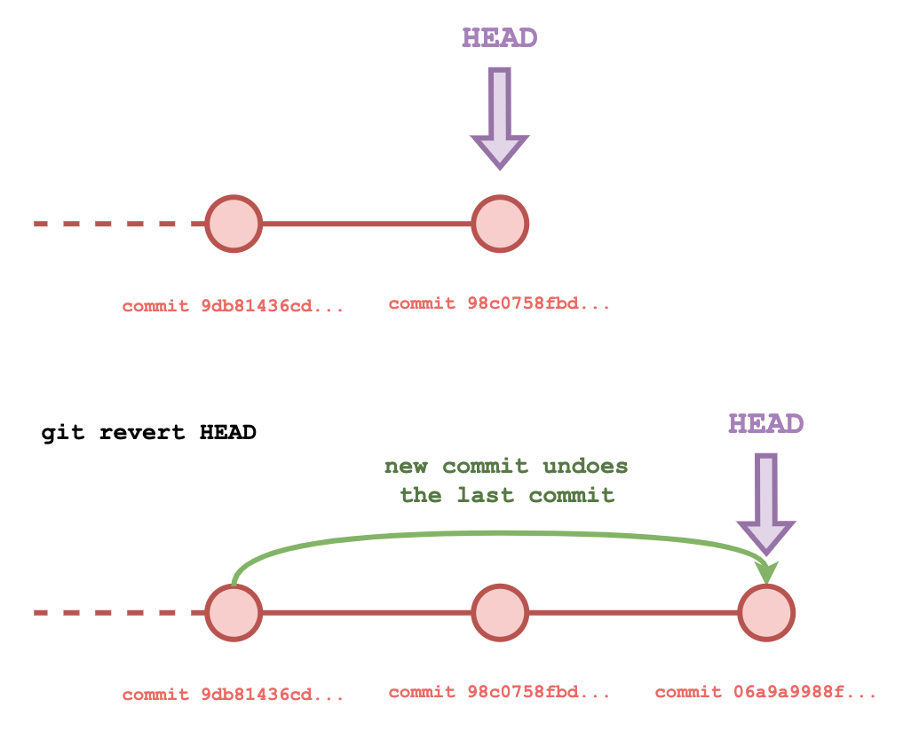
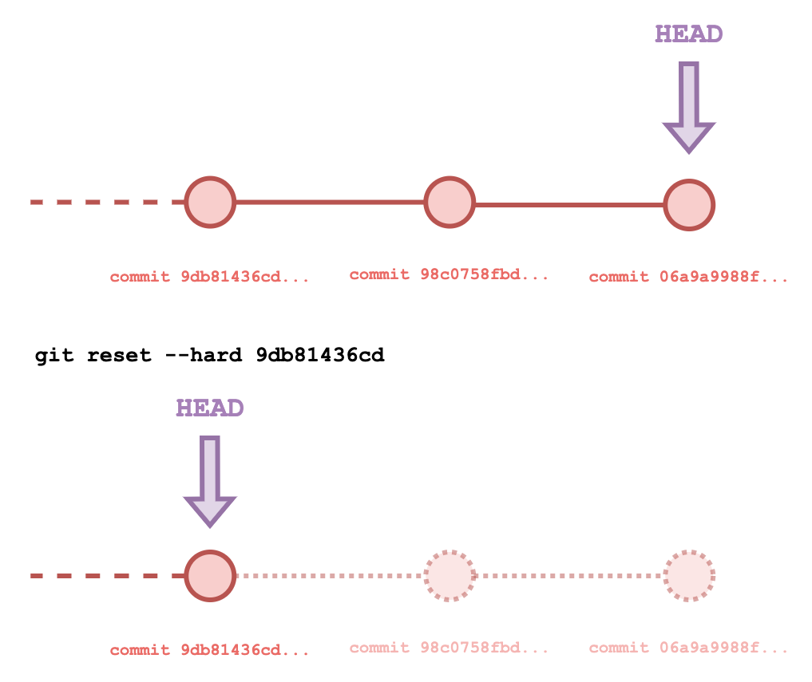

# Reverting

- [Reverting](#reverting)
  - [Overview](#overview)
  - [Reverting](#reverting-1)
    - [Reviewing the history of a repository](#reviewing-the-history-of-a-repository)
    - [Reverting the Last Commit](#reverting-the-last-commit)
    - [Reverting Multiple Commits](#reverting-multiple-commits)
  - [Resetting](#resetting)
  - [Tutorial](#tutorial)
    - [Initialise a Repository](#initialise-a-repository)
    - [Revert the Fourth Commit](#revert-the-fourth-commit)
    - [Reset to the Second Commit](#reset-to-the-second-commit)
  - [Exercises](#exercises)

## Overview

If you ever wish to reset the project to a particular point in the version history, you can **revert** or **reset** the project to any previous commit.

## Reverting

Reverting a Git project is the process making a new commit to the version history based on the file structure of the project at a previous point in the version history.

This process preserves the history of the Git repository as the revert is a *new point in the version history* that is identical to a previous version – it is **not** rewriting the history in any way.

This is the safest way to go back to a point in the version history as it is non-destructive and can be undone in the event of a mistake.

### Reviewing the history of a repository

In order to revert the repository to a previous commit, we need to know the commit's unique identifying hash.

We can do this with:

```bash
git log
```

This command will show you the history of all commits for the current branch, with the output including the date, author, commit message and the identifying hash.

To get the commit history of a specific branch, you can specify:

```bash
git log <branch_name>
```

Using `--oneline` flag simplifies the output into one line per commit:

```bash
git log --oneline
```

Using the `--graph` option will show all branches in the Git history:

```bash
git log --graph
```

### Reverting the Last Commit

Imagine that your `git log --oneline` looks similar to this:

```text
55307ba (HEAD -> master) fourth commit
4e17a31 third commit
d786529 second commit
90f572d first commit
```

To undo the last commit that was made (i.e. `55307ba fourth commit`), you can use:

```bash
git revert HEAD
```

`HEAD` is a reference to the current point in the commit history. By doing so, we are telling Git to revert the changes made in the commit provided, in this case the current commit. We could also provide the identifying hash of the current commit (`55307ba` in this example) to the same effect.



Git will create a new commit that will do the opposite of the previous commit. For example, if you added a piece of code you didn't need, the revert would create a commit deleting this piece of code.

The commit history will therefore look like this:

```text
184d97b (HEAD -> master) Revert "fourth commit"
55307ba fourth commit
4e17a31 third commit
d786529 second commit
90f572d first commit
```

The history will still contain the fourth commit, but it's changes will be undone. Using revert allows us to use the same branch and is considered the better solution for reverting.

### Reverting Multiple Commits

Take the following commit history:

```text
53f9e84 (HEAD -> master) fourth commit
62d5a21 third commit
3eaf21c second commit
5595008 first commit
```

In order to revert to `5595008 first commit`, we would have to run the following commands:

```bash
git revert --no-commit 53f9e84
git revert --no-commit 62d5a21
git revert --no-commit 3eaf21c
git commit -m "Reverting to first commit"
```

Each `git revert ...` command undoes the changes made in each commit. You need to perform each change sequentially, otherwise Git can't resolve the differences between each commit.

Using `--no-commit` allows us to commit multiple reverts with a single commit.

A simpler way to achieve the same result is to use `git checkout` like so:

```bash
git checkout -f 5595008 -- .
git commit -m "Reverting to first commit"
```

## Resetting

To reset the version history to a previous commit, we can use:

```bash
git reset --hard <hash>
```

Where `<hash>` is the identifying hash for the commit you wish to reset the repository to.



Take the following commit history:

```text
53f9e84 (HEAD -> master) fourth commit
62d5a21 third commit
3eaf21c second commit
5595008 first commit
```

To revert back to `5595008 first commit`, we would run:

```bash
git reset --hard 5595008
```

Running `git log` will show that the commits that were made after the first commit are now entirely gone, as opposed to a doing a revert which would preserve the history. 

**There is no way to undo resetting the commit history**. You should therefore be very careful when attempting to reset the commit history.

You should also note that not having a commit reflected in the commit history can cause complications when working with a shared remote repository.

If the reset happened to a commit that is already shared with others, and we tried to push some changes afterwards, Git would throw an error.

This is because it would think that our local Git history isn't up to date. In these scenarios, it's more appropriate to use the revert strategy.

## Tutorial

### Initialise a Repository

1. Open your terminal program (*Git Bash* on Windows, *Terminal* on macOS or Ubuntu).

2. Change directory to your Documents folder:

    ```bash
    cd ~/Documents
    ```

3. Make a new folder called `git-reverting-tutorial`:

    ```bash
    mkdir git-reverting-tutorial
    ```

4. Make the folder the current working directory:

    ```bash
    cd git-reverting-tutorial
    ```

5. Initialise the folder as a Git repository:

    ```bash
    git init
    ```

6. Create a new file:

    ```bash
    touch file
    ```

7. Copy the following commands to generate some commits:

    ```bash
    echo "first change" >> file
    git add file && git commit -m "first commit"

    echo "second change" >> file
    git add file && git commit -m "second commit"

    echo "third change" >> file
    git add file && git commit -m "third commit"

    echo "fourth change" >> file
    git add file && git commit -m "third commit"
    ```

    Here we have added the lines `first change`, `second change`, `third change` and `fourth change` to the file as four separate commits. View the contents of the file with the following command:

    ```bash
    cat file
    ```

    You'll see the following output in your terminal:

    ```text
    first change
    second change
    third change
    fourth change
    ```

### Revert the Fourth Commit

1. To revert the last commit that was made, enter:

    ```bash
    git revert HEAD
    ```

    A command-line editor will appear with the following message:

    ```text
    Revert "fourth commit"

    This reverts commit 48437a28675f5c81b91565aa92b609fd3452df6a.

    # Please enter the commit message for your changes. Lines starting
    # with '#' will be ignored, and an empty message aborts the commit.
    #
    # On branch master
    # Changes to be committed:
    #       modified:   file
    #
    ```

    This is the message that will be saved to the new commit. You can leave this message as is or edit it to your liking. Save the file and close the editor.

    > If the commit message is opened in `nano`, enter `Ctrl + X` to exit. At the bottom of the screen, you'll be asked to `Save modified buffer ?` (essentially asking "do you want to save before you exit?" – press `Y` and hit enter.

2. Check the contents of `file`:

    ```bash
    cat file
    ```

    You should see the following:

    ```text
    first change
    second change
    third change
    ```

    The last line that was added with the last commit (`fourth change`) will have disappeared.

3. Check the commit history with: 

    ```bash
    git log
    ```

    You'll see that the last two commits are:

    ```text
    commit 8eb66670d48d1b819b8a809629fbf5aafca00cab (HEAD -> master)
    Author: htr-volker <htr.volker@gmail.com>
    Date:   Sun Mar 27 17:09:14 2022 +0100

        Revert "fourth commit"
        
        This reverts commit 48437a28675f5c81b91565aa92b609fd3452df6a.

    commit 48437a28675f5c81b91565aa92b609fd3452df6a
    Author: htr-volker <htr.volker@gmail.com>
    Date:   Sun Mar 27 17:07:58 2022 +0100

        fourth commit
    ```

    The `fourth commit` is still preserved in the commit history, but the changes from the most recent commit effectively undoes the changes made in `fourth commit`.

### Reset to the Second Commit

1. View the commit history:

    ```bash
    git log --oneline
    ```

    You should see a similar history to the following:

    ```text
    8eb6667 (HEAD -> master) Revert "fourth commit"
    48437a2 fourth commit
    7aa13d1 third commit
    5e7db3d second commit
    06a9a99 first commit
    ```

    Copy the hash for the `second commit`. In the above history, it would be `5e7db3d`. This is the commit we want to reset the repository back to.

2. To reset the commit history to the point before the fourth commit, enter:

    ```bash
    git reset --hard <second_commit_hash>
    ```

    Replacing `<third_commit_hash>` for the hash you copied in step 1 of this section.

3. Print the contents of `file` to the console:

    ```bash
    cat file
    ```

    You should see the following printed to the console:

    ```text
    first change
    second change
    ```

    The 

4. View the commit history:

    ```bash
    git log --oneline
    ```

    You should see the following:

    ```text
    5e7db3d (HEAD -> master) second commit
    06a9a99 first commit
    ```

    The last three commits that were made have been wiped from the commit history entirely.

## Exercises

There are no exercises for this module.
